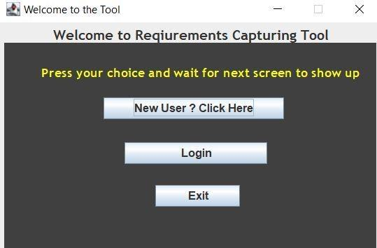
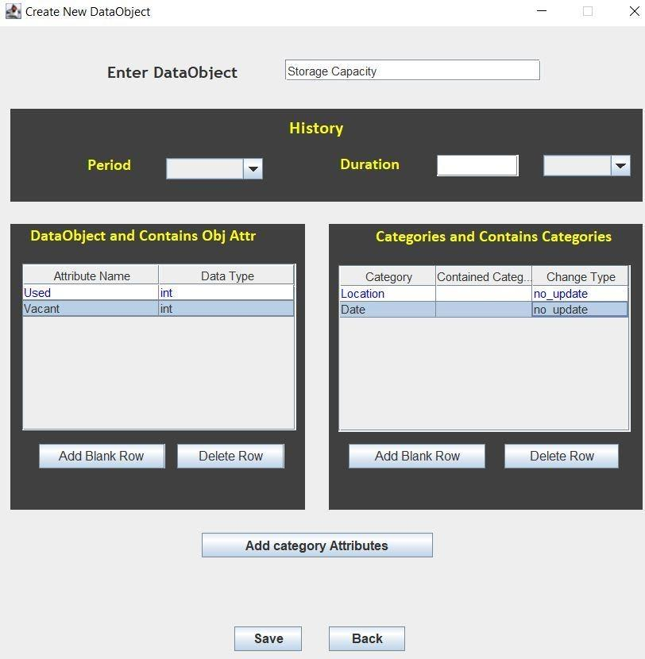
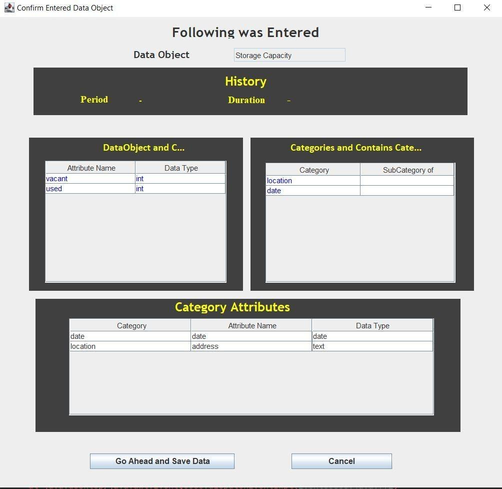
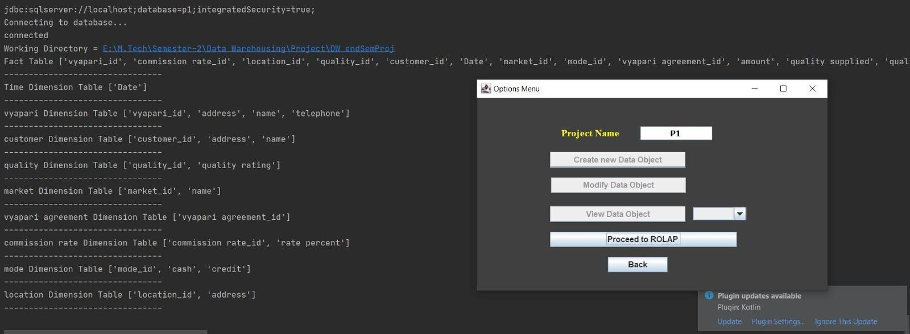
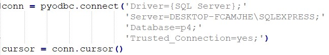
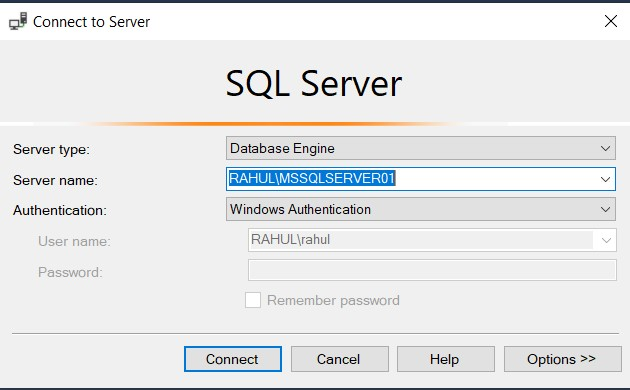
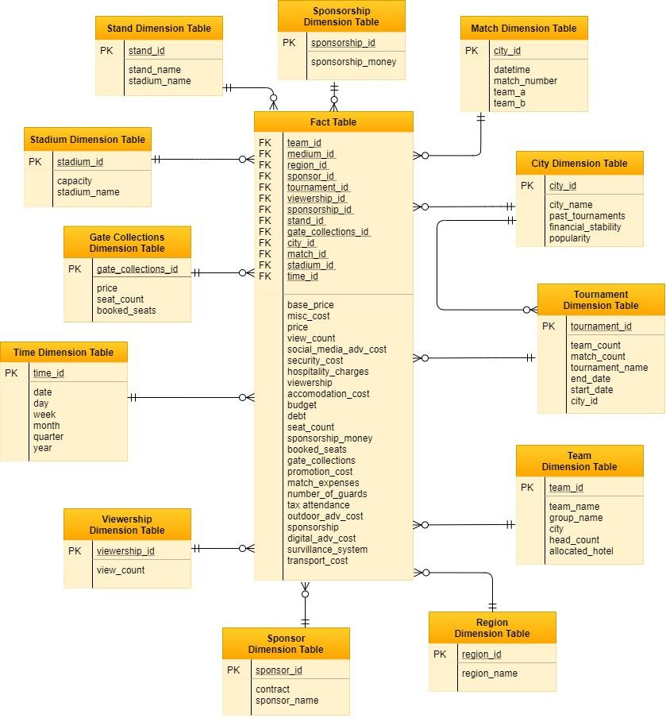
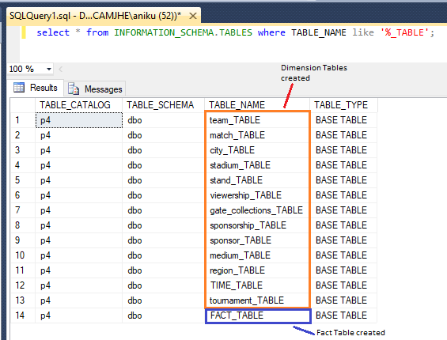
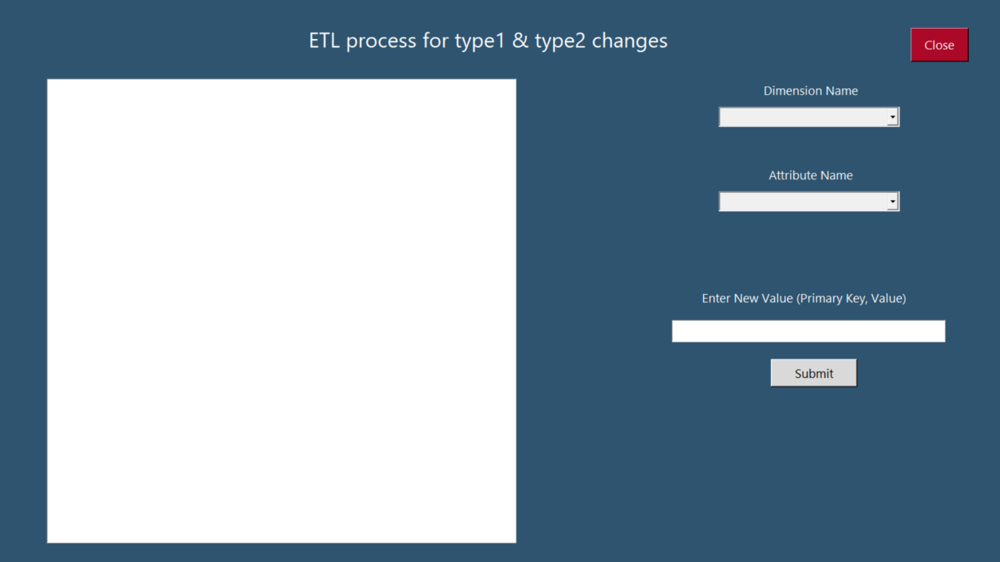
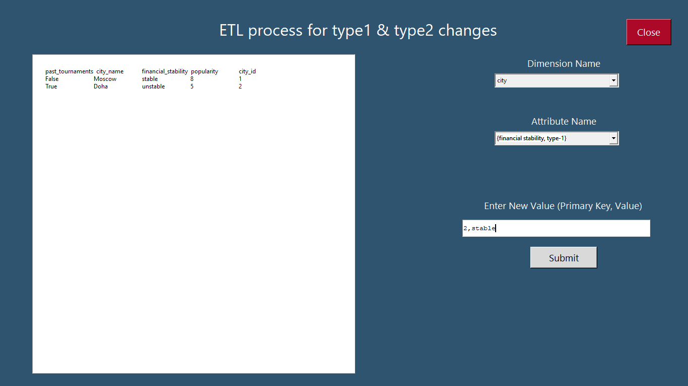

# Select a city Data Warehousing GOM4DW to Star Schema Conversion and ETL Tool
The problem at hand was to select a city for hosting the football world cup for which DIEM (Decision Information Elicitation Model) was built and GOM4DW (Geometry Object Model 4 Data Warehouse) to Star Schema conversion was performed using tool written in Java and ETL process was performed using GUI made using python tkinter and etl tool backend as python too.

# Table of Contents
- [Introduction](#introduction)
- [Dataset](#dataset)
- [Uncertainties](#uncertainties)
- [Actions](#actions)
- [Objectives](#objectives)
- [Installation](#installation)
- [Requirements](#requirements)
- [Schema](#schema)
- [ETL](#etl)
- [Results](#results)
- [Contribution](#contribution)

## Introduction
Data Warehouses are required when we have to make some decision by analyzing a large number of uncertainties, objects, actions and multiple objectives. For the problem defined above, it satisfies all the points mentioned in the previous sentence and thus required a Data Warehouse for best results. To analyze and manage the data warehouse, several schema representation of the data is generated and ETL process is performed. For both these operations, a GOM4DW to Star Schema and a ETL tool is designed.

## Dataset
The database we used is named as **P4**. It is created using MSSQL (Microsoft SQL Server) and exported as P4.xlsx which can be imported back again into MSSQL server easily using the MSSQL import wizard.

I recommend using **Microsoft SQL Server Management Studio 18**.

If you face any difficulty in importing the database
please refer to the this [link](https://www.sqlserverlogexplorer.com/import-and-export-database/).

## Uncertainties
Some of the uncertainties are listed below. In total, there are many more unceratinties, we have taken only a few for the sake of simplicity.
1. Security for spectators and players
2. Popularity of the sport in city
3. Financial status of the city

## Actions
Some of the actions are listed below. In total, there are many more actions, we have taken only a few for the sake of simplicity.
1. Organize Match
2. Accommodate teams
3. Manage bookings

## Objectives
1. Maximize Gate Collections – **MEANS**
2. Maximize Sponsorship - **MEANS**
3. Minimize Expenditure - **MEANS**
4. Maximize Viewership - **CSF**
5. Maximize Revenue – **ENDS**

CSF - Critical Success Factor is the one that is critical for the success of the main problem. It determines whether taken action for the decision is measured as success or failure.

ENDS - Ends Objective is the ultimate goal of selecting the city

MEANS - The intermediate objectives which need to be achieved in order to get to the ENDS objective and satisfy CSF

## Installation
To run this tool, please execute **WelcomeScreen.java** if you want to work on a new project.

If you want to launch an
already existing project then execute **LoginScreen.java** and provide the project name as **P4**. 
The java files are located in
Java Tool \src\com\FinalInfo.

To access the ETL tool, please execute **etl.py** under ETL Tool folder.

Note: Change the server connection code as follows

to

in code, replace server name to your server name in every python db connect statements else it will not work.

For more details on how to run the tools and each and every procedure please refer to DW_Report.pdf and DW_README.pdf.

## Requirements
Java and Python needs to be installed on local machine

Following are the libraries required for python
* tkinter
* pyodbc
* re

## Schema
Star Schema and Database tables are shown below

## ETL

For the ETL (Extract, Transform, Load) process, a GUI (Graphical User Interface) is created for easy and convenient
operations. It is created to handle the changes for Type-1 and Type-2 attributes that are present in schema.The GUI is
implemented using Python with the help of tkinter library.

For the detailed working refer to the pdfs.

## Results
All the required tools were working perfectly with GUI screens for easy input. All expectations and objectives were met regarding the project

## Contribution
Project was created by [Rahul Maheshwari](mailto:rahul19027@iiitd.ac.in), [P. Akshay Kumar](mailto:akshay19094@iiitd.ac.in) and [Nikunj Agarwal](nikunj19093@iiitd.ac.in). Feel free to contact us.
